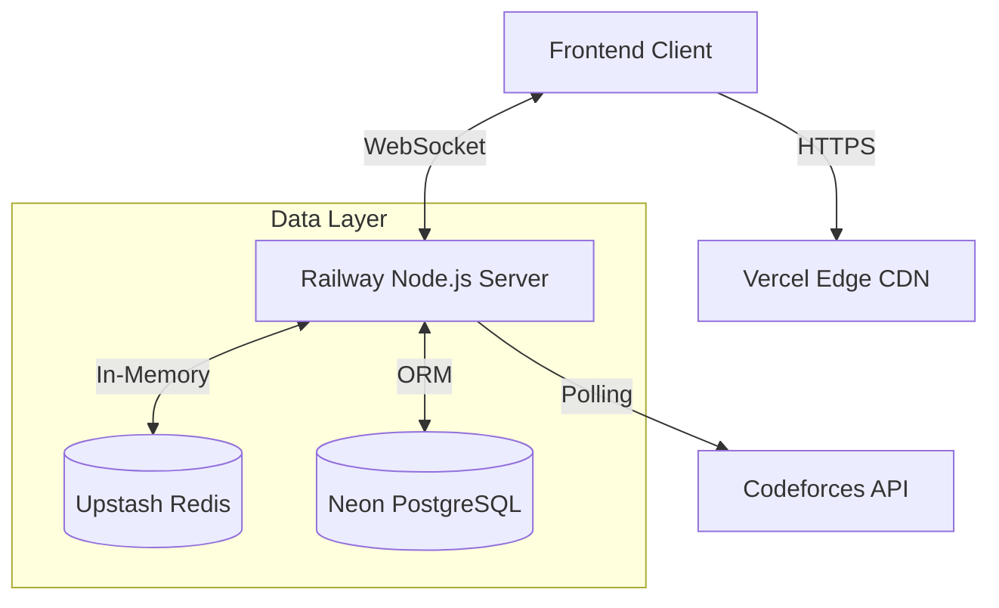
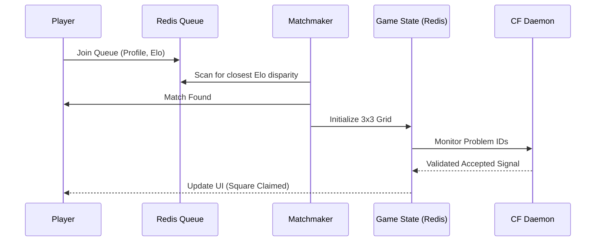
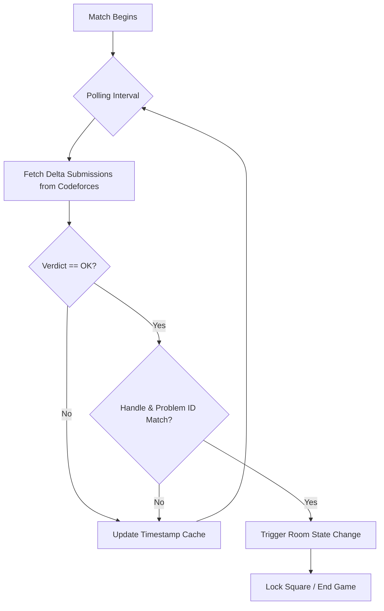

# CP Arena

A full-stack, real-time multiplayer platform designed for the competitive programming community. CP Arena transforms algorithmic problem-solving into a high-speed esports experience through live matchmaking, interactive game modes, and automated submission verification.

## Project Overview

CP Arena replaces standard solitary practice with head-to-head competition. It directly interfaces with the Codeforces API to verify problem submissions in real-time, requiring zero manual input from players.

### Core Game Modes

*   **Ranked 1v1 (Tic-Tac-Toe):** Players are dynamically paired based on an internal Elo rating system. Matches are fought on a 3x3 grid. To claim a square, a player must be the first to solve the unique Codeforces problem assigned to that specific tile.
*   **Custom Lobbies (FFA Shootout):** Unranked, sudden-death multiplayer. Players generate a six-digit room code to invite up to four other friends (five players total) into a race-to-the-finish algorithmic shootout.

## Architecture and Tech Stack

The platform is built on a split-stack architecture, decoupling the client interface from the stateful game server to optimize for both global UI delivery and persistent WebSocket connections.

### Frontend (Client)
*   **Framework:** React 18, Vite, TypeScript
*   **Styling:** Tailwind CSS
*   **Networking:** socket.io-client, standard fetch API for historical data
*   **Deployment:** Vercel (Edge CDN)

### Backend (Game Server)
*   **Runtime:** Node.js, Express, TypeScript
*   **Real-Time Engine:** Socket.io (Persistent connections)
*   **Database ORM:** Prisma (@prisma/client)
*   **Deployment:** Railway.app (Persistent Containers)

### Data Layer
*   **Primary Database:** PostgreSQL (Hosted on Neon) - Stores user profiles, Elo ratings, and complete match history ledgers.
*   **In-Memory Store:** Redis (Hosted on Upstash) - Manages high-speed matchmaking queues, active lobby states, and live game loops.

## Key Design Choices

### 1. The Split-Stack Deployment Model

Serverless platforms terminate backend functions after a few seconds, which fundamentally breaks WebSockets. To solve this, the infrastructure is intentionally split:

*   Vercel acts purely as a global CDN for the compiled React UI, guaranteeing millisecond load times globally.
*   Railway provisions a persistent, 24/7 container to host the Node.js daemon, keeping the Socket.io pipelines continuously open for live games.

### 2. Custom Codeforces Polling Daemon

Codeforces does not natively support webhooks for accepted submissions. To achieve real-time game states without throttling the Codeforces API, the backend utilizes a custom daemon.

*   **1v1 Daemon:** Validates complex 3-in-a-row grid claims.
*   **FFA Daemon:** Scrapes the profiles of all five players in a custom lobby simultaneously, detecting the exact millisecond a problem receives an accepted verdict.

### 3. Serverless Database Connections

Because WebSockets maintain open connections, traditional database connection limits can easily be exhausted when the player base scales. The platform uses `@prisma/adapter-neon` combined with standard WebSockets to route Prisma queries through Neon's serverless connection pooler, ensuring database stability under heavy load.

### 4. Client-Side Routing Safety

Since the frontend is a Single Page Application (SPA), server-side 404 errors naturally occur if a user refreshes a sub-route. A custom configuration rule intercepts all incoming requests and routes them through the main entry point, allowing the router to maintain complete control over the interface state.

## Feature Design and Deep Dive

Building a real-time competitive programming platform required solving several complex state-management and synchronization challenges. Here is a look under the hood at how the core features were architected.

### 1. The Matchmaking Engine (Ranked 1v1)

**The Goal:** Pair players fairly and manage a highly interactive 3x3 Tic-Tac-Toe grid where claiming a square requires solving a unique algorithm.

**The Implementation:**

*   **High-Speed Queuing:** Standard databases are too slow for real-time matchmaking. The system uses Redis to maintain an active queue. When a player clicks to find a match, their profile and Elo are pushed to a Redis sorted set.
*   **Elo Exchange:** The matchmaking utility scans the Redis set to pair players with the closest rating disparity. Upon match completion, a complex multi-way Elo formula calculates the exact rating exchange based on the probability of victory.
*   **Grid State Management:** The 3x3 grid state is held entirely in Redis during the match to ensure sub-millisecond response times. A player cannot claim a square simply by clicking it; the server must receive a cryptographic accepted signal from the Codeforces API tied to that specific cell's problem ID.

### 2. Custom Lobbies and FFA Shootouts

**The Goal:** Allow groups of friends to spin up unranked, sudden-death matches without waiting in a public queue.

**The Implementation:**

*   **Room State Isolation:** The platform utilizes isolated rooms tied to a generated alphanumeric code.
*   **Scalable Polling:** In a five-player Free-For-All, the server must verify the progress of five separate users simultaneously. Instead of making five separate API calls, the custom daemon aggregates the participants and intelligently batches requests to the Codeforces API, minimizing latency and avoiding rate limiting.
*   **Sudden Death Logic:** The shootout state listens for a strict first blood event. The millisecond the daemon detects a valid verdict for any player in the room, it emits a global game over payload, instantly locking the UI for all other players and declaring the winner.

### 3. The Codeforces Verification Daemons

**The Challenge:** Codeforces does not provide native Webhooks to alert external servers when a user solves a problem. Relying on the client to report their own success is a massive security flaw.

**The Implementation:**

*   **Headless Polling:** The platform relies on a custom background worker pattern. Once a match begins, a lightweight, asynchronous loop spins up.
*   **Rate-Limit Evasion:** The daemon polls the user status Codeforces endpoint at calculated intervals. To prevent hitting rate limits, it caches the timestamp of the last known submission and only processes delta changes.
*   **Zero-Trust Verification:** The daemon strictly checks three parameters: user handle, problem ID, and verdict. Only when all three align perfectly does the server trigger a state change in the room.

### 4. Ephemeral State to Persistent Ledger

**The Challenge:** WebSockets and Redis are ephemeral. If the container restarts, active game data vanishes. However, match history and Elo must be permanently recorded.

**The Implementation:**

*   **The Redis-to-Postgres Pipeline:** During an active match, every move, claim, and time-delta is written exclusively to Redis for maximum speed.
*   **The Flush Event:** The exact moment a match concludes, the server triggers a transaction. It pulls the finalized game state from Redis, formats it via the client, and writes the immutable record to the PostgreSQL database.
*   **Serverless Connection Pooling:** Because the backend manages hundreds of open WebSocket connections, a standard PostgreSQL database would quickly exhaust its connection pool. The system routes all history write-downs through a serverless connection pooler to maintain stability.
